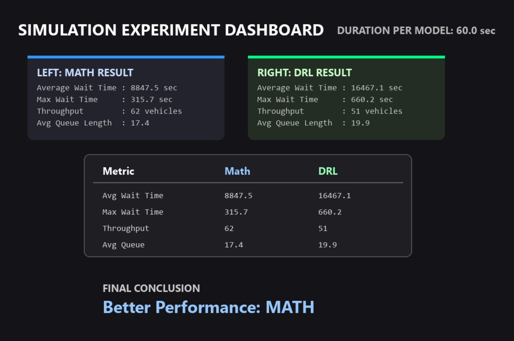

<div align="center">

# SignalSync 🚦

### Smart Traffic Signal Control System

*A high-fidelity intersection simulation that benchmarks Deep Reinforcement Learning against Mathematical Predictive Modeling — in real time.*

[](https://python.org)
[](https://pytorch.org)
[](https://pygame.org)
[](./LICENSE)

**SEM 4 Mini Project · Computer Engineering · 2025**

[🚀 Run the Simulation](#-getting-started) · [📐 Architecture](#-architecture-notes) · [📊 How Benchmarking Works](#-benchmarking-system) · [👥 Team](#-team)

</div>

---

## 🧠 What is SignalSync?

SignalSync is a physics-based traffic intersection simulator built to answer one question:

> **Can a Deep Reinforcement Learning agent outperform a hand-crafted mathematical model at controlling traffic signals?**

It runs both models on the same intersection, under identical traffic conditions, and produces a live side-by-side performance comparison — tracking wait times, throughput, and queue lengths across all four lanes.

No fixed timers. No guesswork. Just two algorithms competing for the fastest flow.

---

## 📸 Screenshots

### 🎬 Landing Screen
> *The SignalSync dashboard with animated grid, pulsing intersection nodes, and floating particles.*


---

### 🗺️ Live Simulation View
> *Real-time vehicle movement, color-coded signal states, and per-lane metrics panel.*


---

### 📊 Benchmark Results Dashboard
> *Head-to-head comparison after both models complete their runs.*



---

## ✨ Key Features

| | Feature | Description |
|---|---|---|
| 🚗 | **Physics-Based Simulation** | Vehicles with realistic acceleration, deceleration, and collision avoidance at a 4-way intersection |
| 📐 | **Mathematical Model** | Weighted scoring + prediction algorithm using real-time queue lengths and vehicle arrivals |
| 🤖 | **DRL Agent (DQN)** | PyTorch Deep Q-Network observing a 12-parameter intersection state to learn long-term optimization |
| 🛡️ | **Hybrid Safety Override** | Prevents traffic starvation — steps in if the AI makes dangerously inefficient decisions |
| 📊 | **Live Metrics Panel** | Real-time queue lengths, density scores, and signal phase tracking across N/S/E/W |
| ⚗️ | **Fair Benchmarking** | Fixed random seed ensures both models face identical traffic across sequential runs |
| 🏆 | **Results Dashboard** | Programmatic winner declaration based on avg wait, max wait, throughput, and queue length |

---

## ⚙️ How It Works

### The Two Competing Models

**Model A — Mathematical Predictive Model**

A deterministic scorer inside `mathematical_model/` that evaluates every lane on every tick:

- **`scoring_model.py`** computes a weighted score per direction from current queue length + accumulated wait time
- **`prediction.py`** estimates incoming vehicle arrivals to anticipate congestion before it peaks
- Applies a **fairness threshold** — forces a lane switch if a direction has waited too long
- Applies an **emergency threshold** — overrides everything if one lane is critically congested
- Fully transparent: every decision is traceable to a formula

**Model B — Deep Reinforcement Learning Agent (DQN)**

A PyTorch-powered neural network inside `drl_model/`:

- **`agent.py`** defines the DQN policy network and action selection logic
- **`environment.py`** wraps the simulation as a Gym-style environment with state, reward, and step logic
- **`train.py`** handles the training loop with experience replay and epsilon-greedy exploration
- **`dqn_agent.pth`** holds the pre-trained weights — no training required to run inference
- Protected by a **Hybrid Safety Override** that vetoes decisions which would starve a congested lane

---

## 📊 Benchmarking System

SignalSync uses a reproducible, sequential experiment flow to ensure a scientifically fair comparison:

```
┌──────────────────────────────────────────────────────────────┐
│                    EXPERIMENT FLOW                           │
│                                                              │
│  1. User sets duration (e.g. 60s, 120s)                     │
│                                                              │
│  2. Math Model runs → metrics tracked via metrics.py        │
│       ↓                                                      │
│  3. Full intersection reset + fixed random seed applied      │
│       ↓                                                      │
│  4. DRL Agent runs → same traffic, same seed                 │
│       ↓                                                      │
│  5. comparator.py ranks both models across 4 metrics        │
│     → declares winner on the results dashboard              │
└──────────────────────────────────────────────────────────────┘
```

**Metrics tracked independently per model** via `evaluation/metrics.py`:

| Metric | Description |
|---|---|
| **Average Waiting Time** | Mean seconds a vehicle waits at red across the full run |
| **Maximum Waiting Time** | Worst-case wait experienced by any single vehicle |
| **Total Throughput** | Total vehicles that successfully cleared the intersection |
| **Average Queue Length** | Mean vehicles queued across all four lanes |

---

## 🛠️ Tech Stack

| Layer | Technology |
|---|---|
| **Simulation Engine** | Python, Pygame |
| **Machine Learning** | PyTorch (DQN Architecture) |
| **Data & Analytics** | NumPy, Pandas, Matplotlib |
| **Traffic Generation** | Custom weighted probability engine (LOW / BALANCED / PEAK) |

---

## 📂 Directory Structure

```
SignalSync/
│
├── main.py                       # Entry point — landing screen + experiment orchestrator
├── requirements.txt              # Python dependencies
├── package-lock.json
├── README.md
│
├── drl_model/                    # Deep Reinforcement Learning
│   ├── agent.py                  # DQN policy network + action selection
│   ├── dqn_agent.pth             # Pre-trained agent weights
│   ├── environment.py            # Gym-style simulation wrapper (state/reward/step)
│   └── train.py                  # Training loop — replay buffer, epsilon-greedy
│
├── mathematical_model/           # Deterministic scoring engine
│   ├── prediction.py             # Vehicle arrival prediction
│   └── scoring_model.py          # Weighted queue + wait-time scorer
│
├── simulation/                   # Physics & intersection logic
│   ├── intersection.py           # Signal state machine + phase management
│   ├── traffic_generator.py      # Weighted vehicle spawn (LOW/BALANCED/PEAK)
│   └── vehicle.py                # Movement, stopping, collision avoidance
│
├── evaluation/                   # Benchmarking pipeline
│   ├── comparator.py             # Side-by-side model comparison + winner logic
│   └── metrics.py                # MetricsTracker — wait time, queue, throughput
│
└── visualization/                # Rendering layer
    └── pygame_display.py         # Roads, vehicles, signals, metrics panel
```

---

## 🚀 Getting Started

### Prerequisites

- Python `3.10+`

### Setup

```bash
# 1. Clone the repository
git clone https://github.com/your-username/SignalSync.git
cd SignalSync

# 2. Create and activate a virtual environment
python -m venv venv
source venv/bin/activate        # Windows: venv\Scripts\activate

# 3. Install dependencies
pip install -r requirements.txt

# 4. Launch
python main.py
```

---

## 🎮 Usage

### Running a Benchmark

1. Launch `python main.py` — the animated SignalSync landing screen appears
2. Click **Get Started** to open the configuration panel
3. Set your simulation **duration** (60s recommended for a first run) and **traffic scenario**
4. The **Mathematical Model** runs first — watch the live metrics panel update in real time
5. The intersection **auto-resets** with the same random seed applied
6. The **DRL Agent** runs under identical conditions
7. The **Results Dashboard** appears — `comparator.py` ranks both models across all four metrics and declares a winner

---

## 🏗️ Architecture Notes

- **State vector** — `agent.py` observes 12 normalized parameters: queue lengths (×4), cumulative wait times (×4), and instantaneous traffic density (×4) for N/S/E/W
- **Hybrid Safety Override** — monitors every DQN action before it is applied; substitutes the safest valid alternative if the chosen action would critically starve any lane
- **Fixed-seed fairness** — `random.seed()` and `numpy.seed()` are reset to identical values before each model's run, making the vehicle spawn sequence byte-for-byte identical
- **Pre-trained weights** — `dqn_agent.pth` lets the agent run inference immediately; re-training can be triggered via `train.py`
- **Decoupled evaluation** — `evaluation/` has zero imports from model internals; `metrics.py` hooks into vehicle lifecycle events only

---

## 🗺️ Roadmap

- [ ] Multi-intersection corridor simulation
- [ ] Full DRL training pipeline with learning curves exported to `results/`
- [ ] Statistical significance testing across N runs
- [ ] Export benchmark results as PDF report
- [ ] SUMO integration for real road network import

---

## 👥 Team

**SEM 4 Mini Project · Computer Engineering · 2025**

| Name | GitHub |
|---|---|
| Team Member 1 | [@username](https://github.com) |
| Team Member 2 | [@username](https://github.com) |
| Team Member 3 | [@username](https://github.com) |

---

## 📄 License

This project is licensed under the **MIT License** — see the [LICENSE](./LICENSE) file for details.

---

<div align="center">

*Built with Python, PyTorch, and a lot of red lights.*

**SignalSync — Two models enter. One light turns green.**

</div>
